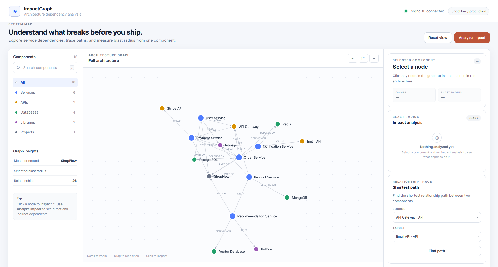
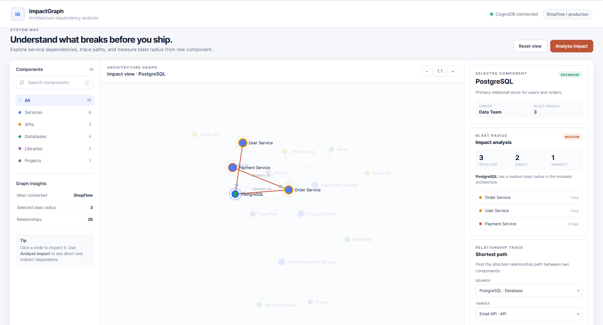
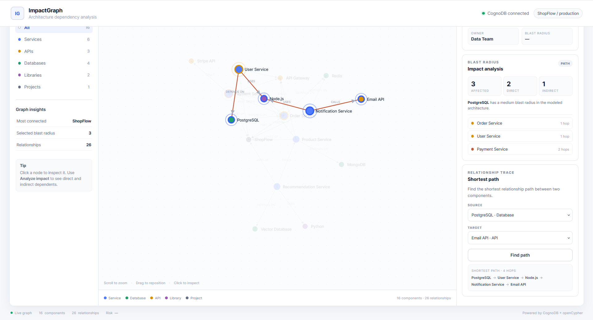

# ImpactGraph

> See what breaks before you ship.

ImpactGraph is a graph-based architecture dependency analysis tool built with **CognoDB**, **openCypher**, and the official **Neo4j JavaScript driver**.

It helps developers explore service dependencies, analyze blast radius, and find multi-hop dependency paths through an interactive architecture graph.

## Demo

**Live Demo:** [https://impactgraph.onrender.com/](https://impactgraph.onrender.com/)

---

## Why ImpactGraph?

Modern applications contain interconnected services, APIs, databases, libraries, and external systems.

When one component fails or changes, understanding its downstream impact can require manually tracing multiple dependencies.

ImpactGraph models these dependencies as a graph so developers can visually explore relationships and answer questions such as:

- Which services depend on this component?
- Which dependencies are direct vs indirect?
- What is the blast radius of a component?
- What is the shortest path between two components?

  ---

## Screenshots

### Architecture Overview



### Impact Analysis



### Dependency Path



---

## Why a Graph Database?

The important part of this problem is the **relationships between components**, not just the components themselves.

A relational database could store components and dependency records, but recursive dependency analysis would require repeated joins or application-side traversal.

With CognoDB, relationships are first-class graph entities and multi-hop traversal can be expressed directly using Cypher.

For example:

```cypher
MATCH (target:Component {id: $id})
MATCH p =
  (affected:Component)-[:DEPENDS_ON|CALLS|USES*1..5]->(target)
WHERE affected.id <> target.id
  AND affected.type = "Service"
RETURN affected, min(length(p)) AS distance
ORDER BY distance, affected.name
```

This allows ImpactGraph to identify both direct and indirect dependents naturally.

---

## Features

### Architecture Graph
Interactive visualization of the complete application architecture.

### Component Inspection
Select a component to view:

- Type
- Description
- Owner
- Blast radius

### Blast Radius Analysis
Calculate:

- Total affected services
- Direct dependents
- Indirect dependents
- Dependency distance

### Shortest Dependency Path
Find the shortest relationship path between any two components.

### Search & Filtering
Search components and filter by:

- Services
- APIs
- Databases
- Libraries
- Projects

### Graph Interaction
- Node selection
- Neighborhood highlighting
- Zoom
- Reset view
- Dependency exploration

---

## Data Model

ImpactGraph uses a simple `Component` node model with typed relationships.

### Nodes

```text
(:Component)
```

Properties:

```text
id
name
type
description
owner
```

Component types include:

```text
Service
API
Database
Library
Project
```

### Relationships

```text
(:Component)-[:DEPENDS_ON]->(:Component)
(:Component)-[:CALLS]->(:Component)
(:Component)-[:USES]->(:Component)
(:Component)-[:PART_OF]->(:Component)
```

### Example

```text
Payment Service
      |
  DEPENDS_ON
      v
Order Service
      |
  DEPENDS_ON
      v
PostgreSQL
```

This allows the application to discover dependencies that are several hops away.

---

## Seed Dataset

The included dataset represents an e-commerce-style architecture called **ShopFlow**.

It contains:

- **16 components**
- **26 relationships**

Example components:

```text
API Gateway
User Service
Order Service
Payment Service
Product Service
Notification Service
Recommendation Service
PostgreSQL
MongoDB
Redis
Stripe API
Email API
Node.js
Python
ShopFlow
```

The repository includes a seed script so the complete graph can be recreated.

```bash
npm run seed
```

---

## Technology Stack

| Layer | Technology |
|---|---|
| Frontend | HTML, CSS, JavaScript |
| Visualization | D3.js |
| Backend | Node.js, Express.js |
| Database | CognoDB |
| Query Language | openCypher |
| Driver | Official Neo4j JavaScript Driver |
| Protocol | Bolt |

### Architecture

```text
Browser
   |
   | HTTP
   v
Node.js / Express
   |
   | Neo4j JS Driver / Bolt
   v
CognoDB
```

---

## Key Graph Queries

### Neighborhood

```cypher
MATCH (n:Component {id: $id})-[r]-(neighbor:Component)
RETURN n, r, neighbor
```

### Blast Radius

```cypher
MATCH (target:Component {id: $id})
MATCH p =
  (affected:Component)-[:DEPENDS_ON|CALLS|USES*1..5]->(target)
WHERE affected.id <> target.id
  AND affected.type = "Service"
RETURN affected, min(length(p)) AS distance
ORDER BY distance, affected.name
```

### Shortest Path

```cypher
MATCH (source:Component {id: $sourceId}),
      (target:Component {id: $targetId}),
      p = shortestPath(
        (source)-[:DEPENDS_ON|CALLS|USES|PART_OF*..10]-(target)
      )
RETURN p
```

All queries use **parameters** rather than string-concatenated Cypher.

---

## Project Structure

```text
impactgraph/
├── public/
│   ├── index.html
│   └── app.js
├── src/
│   ├── config/
│   ├── routes/
│   ├── services/
│   ├── utils/
│   ├── db.js
│   └── server.js
├── queries/
│   ├── impact.cypher
│   ├── neighborhood.cypher
│   └── shortest-path.cypher
├── scripts/
│   └── seed.js
├── .env.example
├── .gitignore
├── package.json
└── package-lock.json
```

---

## Getting Started

### Requirements

- Node.js 18+
- CognoDB Cloud account
- CognoDB C0 instance

### 1. Clone

```bash
git clone YOUR_REPOSITORY_URL
cd impactgraph
```

### 2. Install

```bash
npm install
```

### 3. Create CognoDB

Create a free instance at:

https://console.cognodb.com/

Save the generated Bolt URI and password.

### 4. Configure Environment

Create `.env` from `.env.example`:

```env
PORT=3000

COGNODB_URI=bolt+s://YOUR-INSTANCE-ID.databases.cognodb.cloud
COGNODB_USERNAME=cognodb
COGNODB_PASSWORD=YOUR_PASSWORD
```

Never commit `.env`.

### 5. Seed the Database

```bash
npm run seed
```

### 6. Start

```bash
npm start
```

Open:

```text
http://localhost:3000
```

---

## Error Handling

The application handles database connectivity failures and displays a user-friendly error state instead of exposing raw database errors.

Database credentials are loaded exclusively through environment variables.

---

## Design Decisions

### Single Component Model

Different architecture entities are represented as `Component` nodes with a `type` property. This keeps the graph model simple while supporting services, APIs, databases, libraries, and projects.

### Typed Relationships

Relationships carry architectural meaning:

| Relationship | Meaning |
|---|---|
| `DEPENDS_ON` | Component depends on another |
| `CALLS` | Component invokes another |
| `USES` | Component uses another |
| `PART_OF` | Component belongs to another component |

### Why Multi-Hop Traversal?

The core purpose of ImpactGraph is understanding indirect dependencies.

For example:

```text
Payment Service
      |
  DEPENDS_ON
      v
Order Service
      |
  DEPENDS_ON
      v
PostgreSQL
```

Although Payment Service does not directly depend on PostgreSQL, graph traversal can discover the two-hop dependency.

---

## Author

**Munazza Sultana**

Built for the **WEXA AI CognoDB Take-Home Assignment**.

**ImpactGraph — See what breaks before you ship.**
